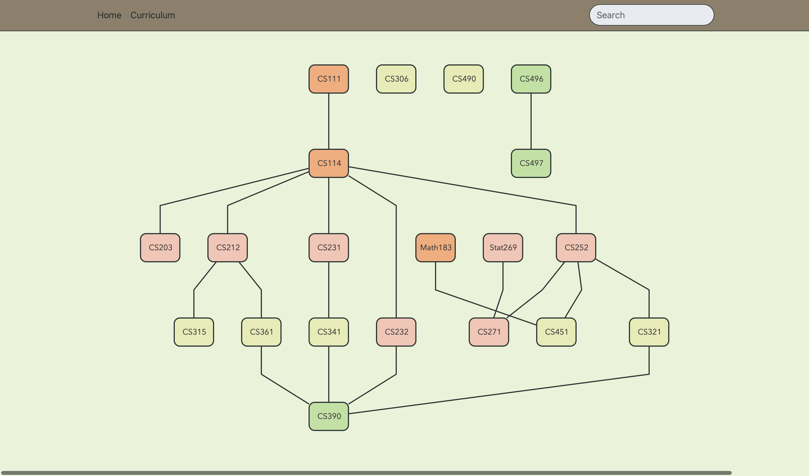

# Prerequisite Tree

[](https://sonarcloud.io/summary/new_code?id=AppleBoiy_prerequisite-tree) [](https://github.com/AppleBoiy/prerequisite-tree/actions/workflows/code_quality.yml)



> The Prerequisite Tree tool allows users to visualize and explore the prerequisite relationships between different courses. It fetches course data from a google spreadsheet, converts it into a JSON format, and generates a tree view using the [dagreD3] library.

## Table of Contents

- [Overview](#overview)
- [Features](#features)
- [Wiki](#wiki)
- [How It Works](#how-it-works)
- [Getting Started](#getting-started)
    - [Prerequisites](#prerequisites)
    - [Installation](#installation)
    - [Usage](#usage)
- [Customization](#customization)
    - [Preparing the Spreadsheet](#preparing-the-spreadsheet)
- [Contributing](#contributing)
- [Special Thanks](#special-thanks)
- [License](#license)

## Overview

The Prerequisite Tree tool allows users to visualize and explore the prerequisite relationships between different
courses. It fetches course data from a [Google Sheets], converts it into a JSON format, and generates a tree view
using the [dagreD3] library. Users can hover over nodes to view prerequisite details and navigate the tree to understand
the course dependencies.

## Features

- Converts a [Google Sheets] to JSON format
- Generates an interactive prerequisite tree view
- Highlights and provides details of course prerequisites on mouse hover
- Supports customization of node colors and styles

## Wiki

You can access our wiki by visiting [wiki](https://cmu.to/cs-prereq-notion). It contains valuable information We encourage you to explore our wiki to learn more about our project and get the most out of it. If you have any
questions or suggestions, feel free to contribute to the wiki or reach out to our team.

## Prerequisite Tree

The prerequisite tree is a graphical representation of the course prerequisites. It displays the dependency relationships between different courses and allows users to understand the required prerequisites for each course. The tree view is rendered using the [dagreD3] library and provides an interactive and intuitive visualization of the course structure.

## How It Works

The tool fetches a [Google Sheets] containing course data and converts it into a JSON format. It then uses this data
to generate a tree view representation of the course prerequisites. The tree view is rendered using the [dagreD3]
library, which itself utilizes . The data conversion is facilitated by [SheetJS], allowing users to explore the
prerequisite relationships between different courses.

<a name="guidelines"></a>

## Getting Started

### Prerequisites

Before you can use the Prerequisite Tree tool, ensure that you have the following prerequisites:

- [Node.js] (version 12 or higher)
- [Python] (version 3 or higher)
- A modern web browser with SVG support

Please make sure to have Node.js and Python installed on your system, and ensure that your web browser supports SVG rendering.


### Installation

1. Clone the repository:
   ```shell
   git clone https://github.com/AppleBoiy/prerequisite-tree.git
    ```

2. Navigate to the project directory
    ```shell
    cd prerequisite-tree
    ```

3. install the dependencies
    ```shell
    npm install
    ```

### Usage

1. Open the [tree.js] file in text editor.
2. Provide the URL of the spreadsheet in
   the [spreadsheetUrl](docs/js/tree.js#L6) variable inside
   the [tree.js] file.
   ```javascript
   // Some code above

   const main = () => {
       const spreadsheetUrl = "https://link/to/your/spreadsheets";
   
       //Rest of the code goes here
   }
   
   // Some code below
   ```
   Save the changes.

3. Run a local server to serve the files. You can use the following command with Python:
    ```shell
   python -m http.server
    ```
4. Open the web browser and navigate to http://localhost:8000 (or the appropriate address based on your server
   configuration).
5. The prerequisite tree will be displayed based on the data from the spreadsheet.

## Customization

### Preparing the Spreadsheet

To use the Prerequisite Tree tool, you need to prepare a spreadsheet containing the course data. Follow these steps to
prepare the spreadsheet:

1. Create a new spreadsheet using a program like [Google Sheets].
2. Create a table to represent the course data. The table should have the following columns:

   | code   | abbr    | parent | children | conditions          | year | term | full name (ENG)                  | credit |
   |--------|---------|--------|----------|---------------------|------|------|----------------------------------|--------|
   | 204101 | CS101   | -      | 204201   | -                   | 1    | 1    | Introduction to Computer Science | 3      |
   | 204201 | CS201   | 204101 | 204301   | -                   | 1    | 2    | Data Structures and Algorithms   | 4      |
   | 204301 | CS301   | 204201 | -        | Consent of the dept | 2    | 1    | Software Engineering             | 3      |
   | 204401 | CS401   | 204301 | -        | Third year standing | 3    | 2    | Advanced Programming             | 4      |
   | 206101 | MATH101 | -      | -        | -                   | 1    | 1    | Introduction to Mathematics      | 3      |
   | 206201 | MATH201 | 206101 | -        | -                   | 2    | 2    | Calculus                         | 4      |

    - `code`: Represents the course code or identifier.
    - `abbr`: Represents the abbreviation or short form of the course name.
    - `parent`: Represents the parent course code or identifier if there is any.
    - `children`: Represents the child course codes or identifiers if there are any. Use a comma-separated list if there
      are multiple children.
    - `conditions`: Represents any specific conditions or prerequisites for the course.
    - `year`: Represents the academic year in which the course is offered.
    - `term`: Represents the academic term or semester in which the course is offered.
    - `full name (ENG)`: Represents the full name of the course in English.
    - `credit`: Represents the credit value assigned to the course.

3. Fill in the table with the relevant course data, including course codes, names, prerequisites, and descriptions (if
   applicable). Make sure to use the correct course codes for prerequisites to establish the prerequisite relationships
   accurately.
4. Save the spreadsheet and make sure it is accessible online.

Once you have prepared the spreadsheet, you can use it with the Prerequisite Tree tool to generate a graphical
representation of the course prerequisites.

* You can modify the styles in the [tree.css] file to customize the appearance of the prerequisite tree.
* Additional configuration options and functionality can be implemented by modifying the [tree.js] file.

### Contributing

Contributions are welcome! If you have any suggestions, improvements, or bug fixes, please open an issue or submit a
pull request.

## Special Thanks

Special thanks to [dagreD3], [D3.js], and [SheetJS] for providing the libraries and tools that make this educational
tool possible.

## License

This project is licensed under the [MIT License](LICENSE).


[dagreD3]: https://github.com/dagrejs/dagre-d3
[D3.js]: https://d3js.org
[SheetJS]: https://sheetjs.com

[Node.js]: https://nodejs.org/en
[Python]: https://www.python.org

[Google Sheets]: https://docs.google.com/spreadsheets

[tree.js]: docs/js/tree.js
[tree.css]: docs/css/tree.css
